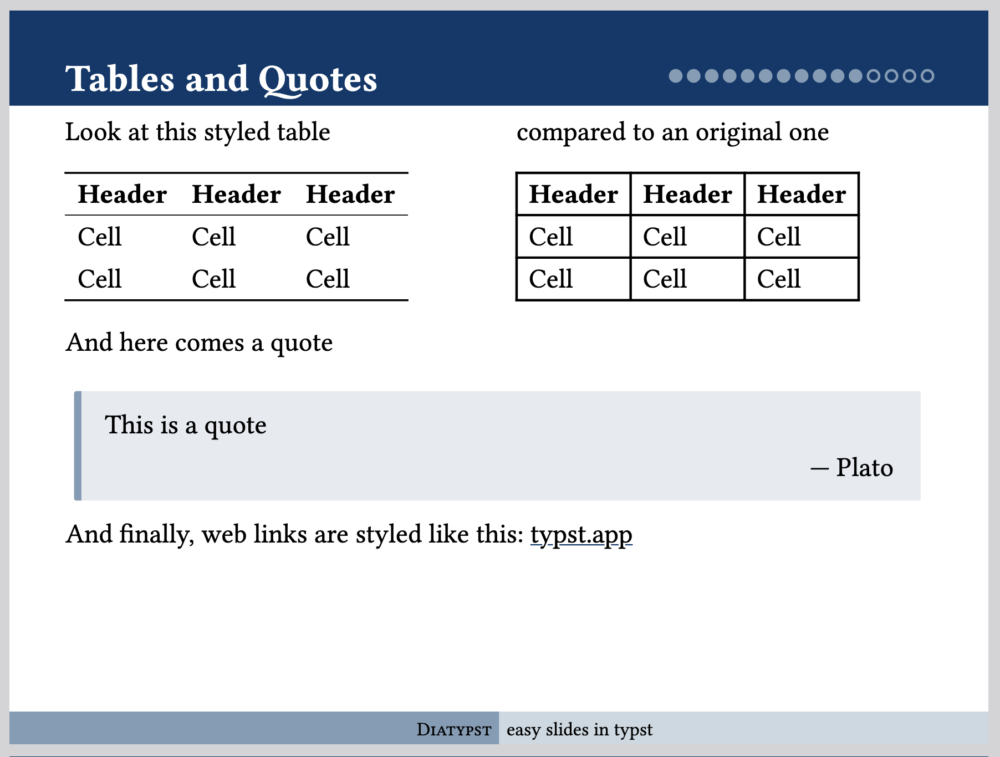

# Example PDF

A shorter version of this guide is also available in a PDF Format, showcasing some of the styling and functionality the package has to offer. Both examples here are styled using their respective theme, but have exactly the same content.

## Normal Theme

Here is a slide of the PDF guide produced using the *normal* theme.

[Click here to go to the PDF](https://raw.githubusercontent.com/skriptum/diatypst/refs/heads/main/example/example.pdf)

[And here is the .typ file that produced this PDF](https://github.com/skriptum/diatypst/blob/main/example/example.typ)

## Full Theme

Exemplary Slide produced with the *full* theme:

[Click here to go to the PDF](https://raw.githubusercontent.com/skriptum/diatypst/refs/heads/main/example/example_full.pdf)

[And here is the .typ file that produced this PDF](https://github.com/skriptum/diatypst/blob/main/example/example.typ)