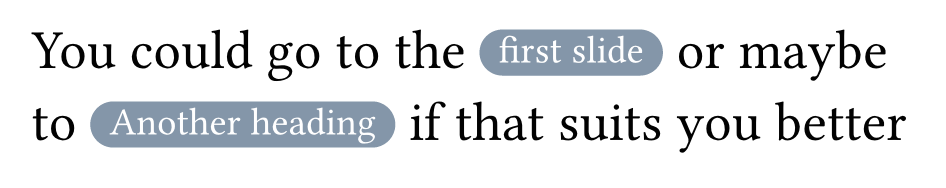

# How to link to specific slides?

In diatypst, you can link to specific slides using the [ref](https://typst.app/docs/reference/model/ref/) function. This is particularly useful for creating references to appendices or other sections of your presentation.

To create a hyperlink to a specific slide, you first need to assign an identifier to the target heading using the `<label>` syntax. Then, you can use the `#ref()` function to create a link to that label.

For example, to create these hyperlinks:



use this code:

```typst
You can go to the  #ref(<label1>, supplement: "first slide") or  maybe to @label2 if that suits you better.
````

Then just adorn your headings with typst labels:

```typst
== Heading <label1>

#lorem(100)

== Another Heading <label2>

#lorem(100)
```

Note that you can either use the `#ref` function with a supplement of the text or the `@label` syntax