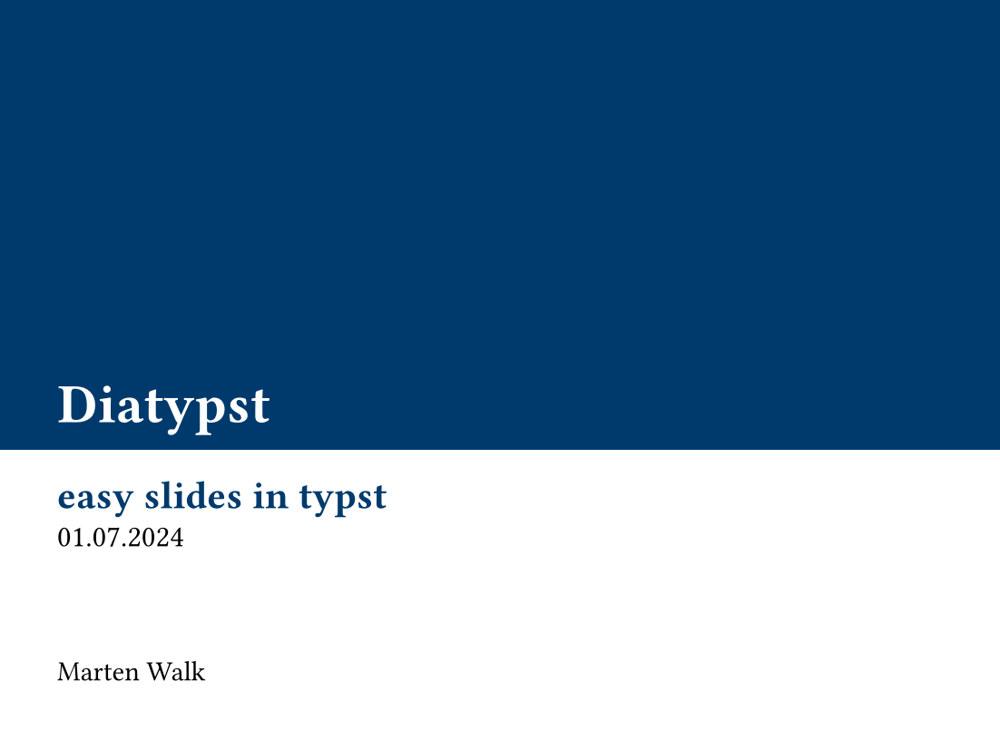
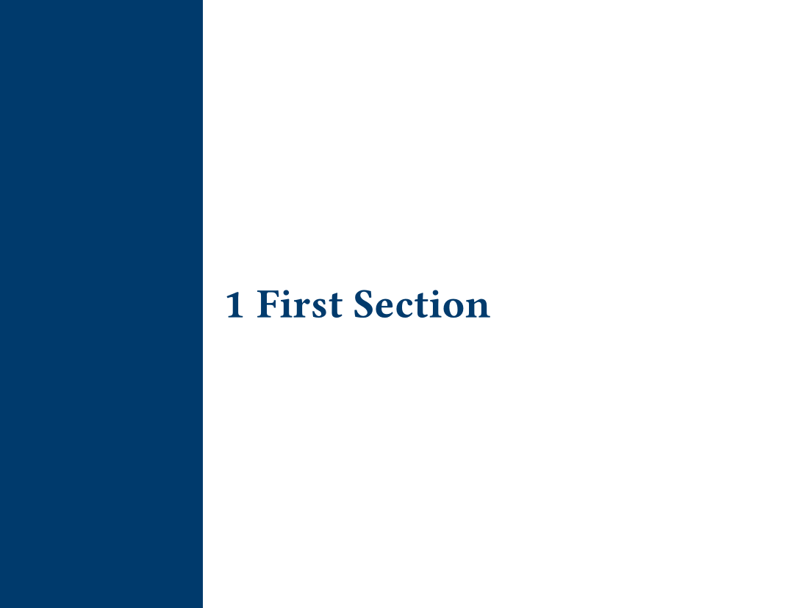
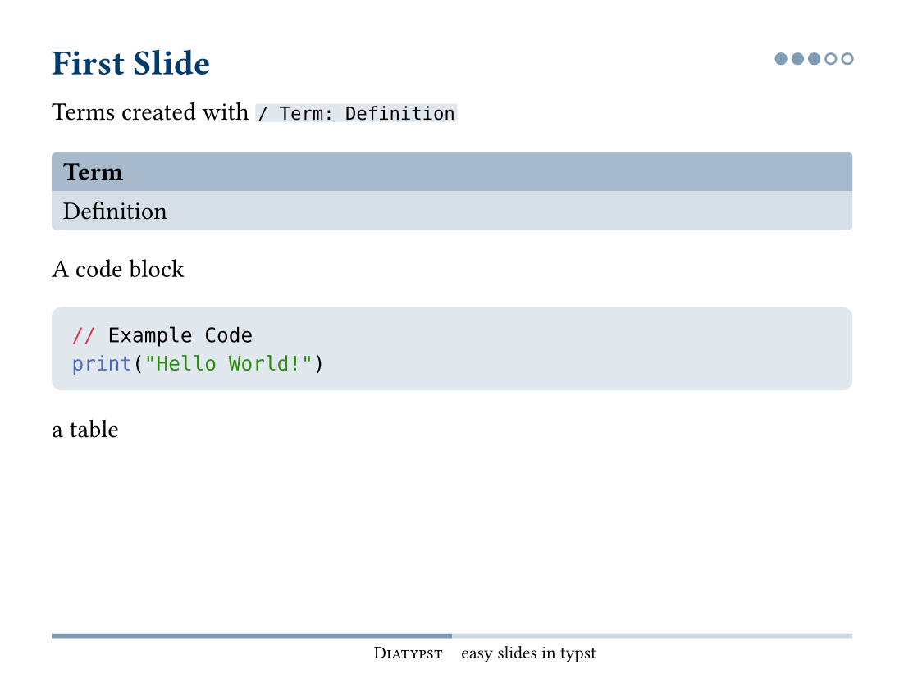
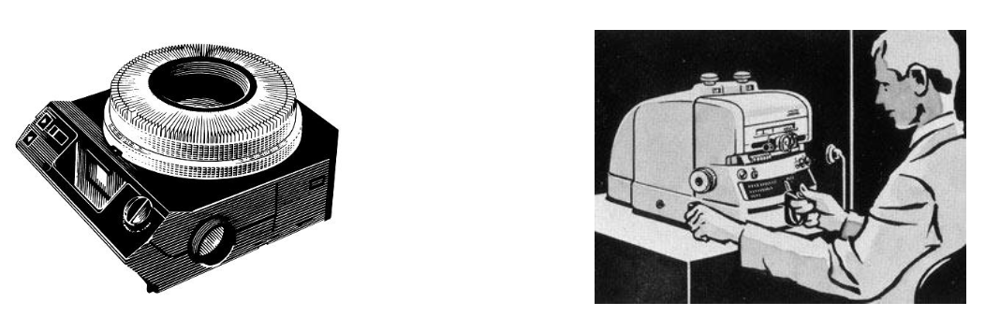

```{image} ./assets/wide_dark.png
:align: center
:class: only-light
```

```{image} ./assets/wide_light.png
:align: center
:class: only-dark
```


# diatypst

*easy slides in typst*

Features:

- easy delimiter for slides and sections (just use headings)
- sensible styling
- dot counter in upper right corner (like LaTeX beamer)
- adjustable color-theme
- default show rules for terms, code, lists, ... that match color-theme

Links: [Typst Universe](https://typst.app/universe/package/diatypst/) | [GitHub](https://github.com/skriptum/Diatypst) | [Homepage](https://mdwm.org/diatypst/)

> if you like *diatypst*, consider giving it a star on GitHub ⭐

To get started, head to the [quickstart](quickstart.md) guide. Alternatively, take a look at the [reference](reference.md) to get a grip on all available options.

---

Here is an example of a *diatypst* presentation

| Title Slide                                     | Section                                             |
| ----------------------------------------------- | --------------------------------------------------- |
|  |  |

| Content (Normal Theme)                          | Content (Full Theme)                                        |
| ----------------------------------------------- | ----------------------------------------------------------- |
|  |  |

These example slides and a usage guide are available in the `example` Folder on GitHub as a [.typ file](https://github.com/skriptum/diatypst/blob/main/example/example.typ) and a compiled PDF ([normal Theme](https://raw.githubusercontent.com/skriptum/diatypst/refs/heads/main/example/example.pdf), [full Theme](https://raw.githubusercontent.com/skriptum/diatypst/refs/heads/main/example/example_full.pdf)). 


## Inspiration

this template is inspired by [slydst](https://github.com/glambrechts/slydst), and takes part of the code from it. If you want simpler slides, look here!

The word *Diatypst* is inspired by the ease of use of a [**Dia**-projektor](https://de.wikipedia.org/wiki/Diaprojektor) (German for Slide Projector, left) and the [Diatype](https://en.wikipedia.org/wiki/Diatype_(machine)) (right)


